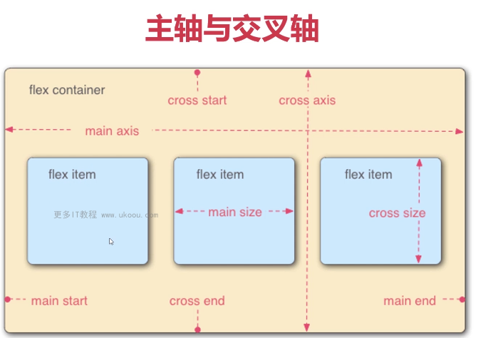
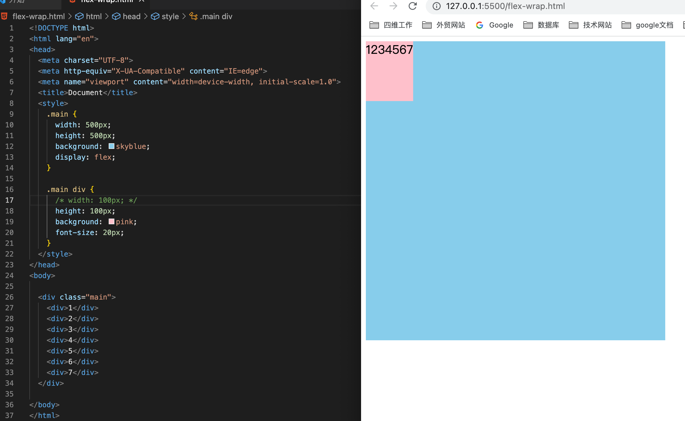
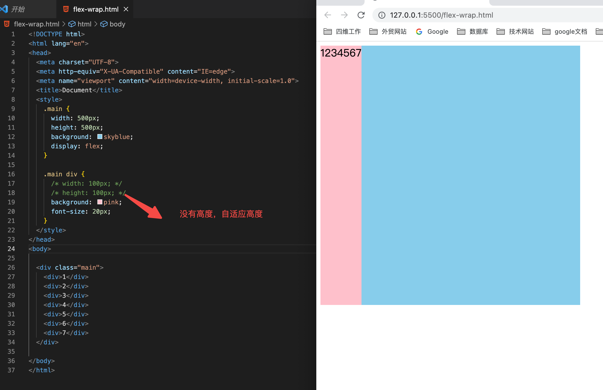
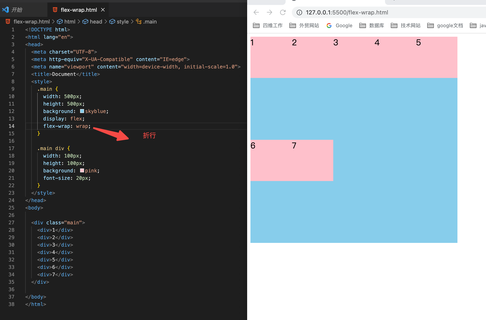
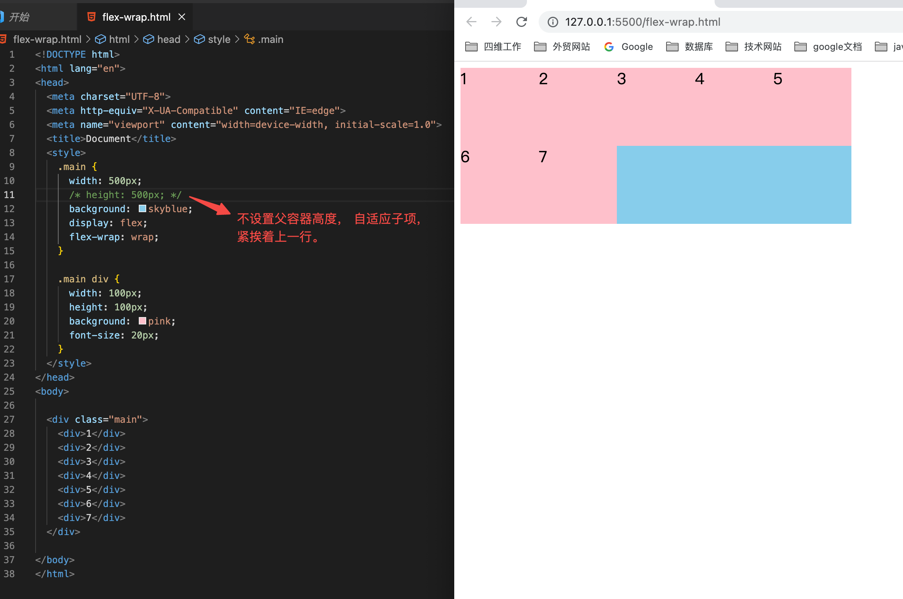
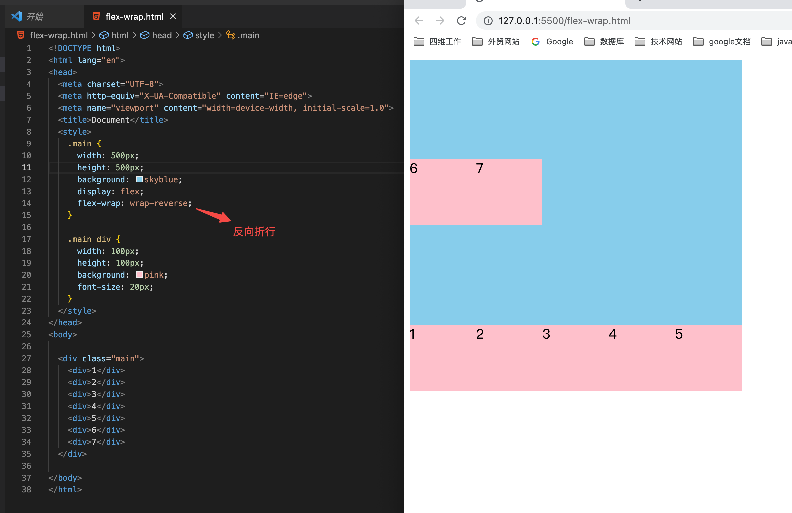
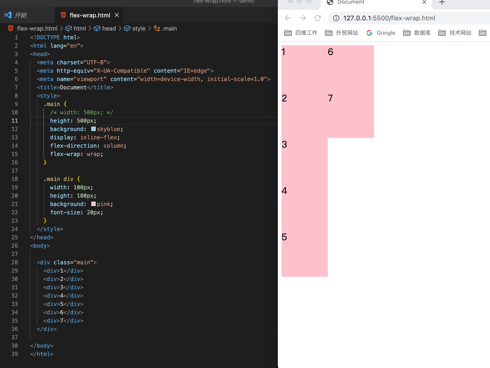
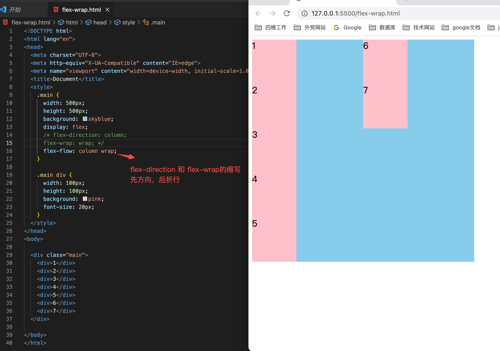

# 1 布局的尺寸和位置

## 1. 需要反复练习案例

1. 轮播图
2. 知乎导航
3. 网易移动端头部实现
4. 网易移动端新闻列表实现
5. B站移动端头部实现
6. B站移动端导航实现
7. B站移动端视频列表实现
8. 博客头部实现
9. 博客导航实现
10. 博客辅助列表实现
11. 博客尾部实现
12. 管理系统实现
13. 溢出项布局
14. StickyFooter布局
15. 子项分组布局
16. 不定项居中布局
17. 均分列布局
18. 栅格布局
19. 容器自适应列
20. 百度热词风云榜
21. 小米导航菜单

## 2. CSS 盒模型

- padding 不能为负值， 而margin可以为负值
- 背景色会平铺到非margin的区域

### 2.1 margin-top传递现象及解决方案

- 子元素的`margin-top`会传递给父元素

```
<style>
    .box1 {
        width: 200px;
        height: 200px;
        background: pink;

    }
    .box2 {
        width: 100px;
        height: 100px;
        background: skyblue;
        margin-top: 30px;
    }
</style>

<div class="box1">
    <div class="box2"></div>
</div>
```

解决方式

- 父元素加边框， 边框可以做成透明的
- 子元素前面还有其它内容
- BFC 格式化上下文

### 2.2 margin 上下叠加现象

上下元素同时设置margin， 会出现叠加现象，取最大的为准

**解决方式**

- BFC格式化上下文

## 3. 块级盒子与内联盒子

- 在CSS中我们广泛地使用两种“盒子” - 块级盒子(block box) 和 内联盒子(inline box). 这两种盒子会在页面中表现出不同的行为方式
- 块级盒子： div, p, h1 ... 内联盒子 span, a, strong ...

### 3.1 块级盒子特性

- 独占一行
- 支持所有样式
- 不写宽度的时候，跟父容器宽度相同
- 所在区域是一个矩形

### 3.2 内联盒子特性

- 盒子不会产生换行
- 有些样式不支持， 例如： width, height(margin, padding支持也不是特别好)
- 不写宽高的话， 宽度由容决定
- 所占的区域不一定是矩形
- 内联标签之间会有空隙(标签之间去掉空隔，可以解决)

### 3.3 如何区分 块级盒子 和 内联盒子

- `display: block` 块级盒子
- `display: inline` 内联盒子

结论： 不要使用内联盒子做布局， 内联盒子做文本修饰。

### 3.4 BFC

BFC 即Block Formatting Contexts(志级格式化上下文)，它决定了其子元素将如何定位， 以及和其他元素的关系和相互作用。

具有BFC特性的元素可以看作是隔离了的独立容器， 容器里面的元素不会在布局上影响到外面的元素， 前且BFC具有普通容器所没有的一些特性。

通俗一点来讲， 可以把BFC理解为一个封闭的大箱子， 箱子内部的元素无论如何翻江倒海， 都不会影响到外部。

**BFC触发条件**

满足以下条件之一， 即可触发BFC

- float的值不是none
- position的值不是static 或者 relative
- display的值是inline-block, table-cell, flex, table-caption 或者inline-flex
- overflow的值不是visible

### 3.5 自适应盒模型的特性

自适应盒模型指的是， 当盒子不设置宽度时， 盒模型相关组成部署分的处理方式是如何的。

当子盒子和 父盒子宽度一样子， 子盒子再添加`padding, maring border` 时，会出现溢出。

当子盒子不设宽度时 ， 子盒子再添加`padding, maring border` 时， 子盒子会收缩。不会产生溢出。

使用自适应盒模型时， 不用再精确计算宽度。

### 3.6 标准盒模型和怪异盒模型 

在标准盒模型中， 如果你给盒子设置了 width 和 height, 实际设置的是content box. padding 和 border 再加上设置的宽高一起决定整个盒子的大小。

#### 3.6.1 怪异盒模型

在怪异盒模型中， 所有宽度者是可见宽度， 所以内容宽度是该宽度减去边框和填充部分。

标准盒模型，content不变， 向外扩张; 怪异盒模型，content 向内收缩

#### 3.6.2 设置怪异盒模型 

```css
box-sizing: border-box
```

#### 3.6.3 box-sizing属性

```css
content-box:  width、height -> content
border-box: width、height -> content +padding + border
```

应用1： 量取尺寸时不用再去计算一些值 应用2： 解决一些需要设置百度比和盒模型值

```css
// 加上padding后， 会产生滚动条溢出
// 设置成 怪异盒模型后， 就会匹配父元素。
input {
    width:  100%;
    padding: 30px;
    box-sizing: border-box;
}
```

## 4. 浮动样式详解

- 当元素浮动时， 会脱离文档流， 根据float的值向左或向右移动， 直到它的外边界碰到父元素的内边界或另一个浮动元素的外边界为止， 是CSS布局中实现左右布局的一种方式。
- 文档流： 文档流是元素在Web页面上的一种呈现方式， 按照出现的先后顺序进行排列。

### 4.1 清除浮动的方案

- clear 属性 (清除上下关系的浮动)
- BFC (清除嵌套关系的浮动)
- 空标签 (清除嵌套关系的浮动)
- .clearfix::after{} （清除嵌套关系的浮动）

#### 4.1.1 上面有左浮动， 下面清除左浮动

- 第一个盒子左浮动， 第二个盒子要清左浮动
- 第一个盒子右浮动， 第二个盒子要清右浮动
- 所以一般情况使用 `clear: both`

```css
.box1 {
    width: 100px;
    height: 100px;
    background: pink;
    float: left;
}
.box2 {
    width: 200px;
    height: 200px;
    background: skyblue;
    clear: left;
}

<div class="box1"></div>
<div class="box2"></div>
```

#### 4.1.2 嵌套清浮动

- 子容器向左浮动， 产生高度塌陷

```css
.box1 {
    width: 200px;
    border: 1px black solid;
    background: pink;
}
.box2 {
    width: 100px;
    height: 100px;
    background: skyblue;
    float: left;
}
    
<div class="box1">
    <div class="box2"></div>
</div>
```

- 添加空标签清浮动， 解决塌陷

```html
<div class="box1">
    <div class="box2"></div>
</div>
```

- 使用after伪类

```css
// 添加的内容是内联盒子， 内联盒子无法清除浮动
// 所以用display 转成块级盒子
.clearfix::after {
    content:"";
    clear: both;
    display: block;
}

<div class="box1 clearfix">
    <div class="box2"></div>
</div>

```

#### 4.1.3 浮动性性注意点

- 只会影响后面的元素
- 文本不会被浮动元素覆盖
- 具备内联盒子特性: 宽度由内容决定
- 具备块级盒子特性: 支持所有样式
- 浮动放不下， 会自动换行(缺点是：空间放不下会折行， 空间不好控制)

**让内联盒子，支持宽高属性**

```css
.inline {
    width: 100px;
    height: 100px;
    background: red;
    float: left
}

<pan class="inline">aaaaaaaaaaaa</span>
```

## 5. 定位样式详解

CSS position 属性用于指定一个元素在文档中的定位方式，其中top, right, bottom和left属性则决定了该元素的最终位置， 黑认是 static

position的取值

- sticky
- fixed
- static
- relative
- absolute

### 5.1 相对定位及特性 relative

- 相对定位的元素是在文档中的正常位置偏移给定的值
- 不影响其他元素布局
- 相对于自身进行偏移

### 5.2 绝对定位有特性 absolute

- 绝对定位脱离了文档流， 绝对定位元素不占据空间
- 具备内联盒子特性： 宽度由内容决定
- 具备块级盒子特性：支持所有样式
- 绝对定位元素相对于最近的非static祖先元素定位。当这样的祖先元素不存在时， 则相对于可视区定位

### 5.3 固定定位及特性 fixed

- 固定定位与绝对定位相似， 但是会固定在可视区中
- 具备内联盒子特性：宽度由内容决定
- 具备块级盒子特性：支持所有样式
- 固定定位元素不受祖先元素影响

### 5.4 黏性定位及特性

粘性定位可以被认为是相对定位和固定定位的混合。 元素在跨越特定阈值前为相对定位，之后为固定定位。

#### 5.5 z-index

...

# 2. Flex弹性布局

## 2.1 flex弹性概念

- 弹性盒子是一种用于按行或按列布局元素的一维布局方法。 元素可以膨胀以填充额外空间， 收缩以适应更小的空间。

## 2.2 主轴与交叉轴



## 2.3 flex 容器与flex子项

## 2.4 flex容器

-  `flex-direction` 改变轴方向
  - `row` (默认) 行方向
  - `row-reverse` 行方向反向
  - `column` 列方向
  - `column-reverse` 列方向反向
-  `flex-wrap`
   -  nowrap （默认）
   -  wrap
   -  wrap-reverse

-  `flex-flow`
-  `justify-content`
-  `align-items`
-  `align-content`


### 2.4.1 **Flex子项**

- `order`
- `flex-grow`
- `flex-shrink`
- `flex-basis`
- `flex`
- `align-self`

### 2.4.2 改变轴方向 `flex-direction`

取值为

- row 默认
- row-reverse
- column
- column-reverse

### 2.4.3换行与缩写 `flex-wrap`

取值为

- `nowrap` 默认
- `wrap`
- `wrap-reverse`


### 2.4.4 主轴对齐详解 `justify-content`

- `flex-start` 默认
- `flex-end`
- `center`
- `space-around`
- `space-between`
- `space-evenly`

### 2.4.5 交叉轴对齐详解`align-content` `align-items`

align-content 取值

- `stretch` 默认
- `flex-start`
- `flex-end` (当折行的情况下， align-content是不生效)
- `center`
- `space-around`
- `space-between`
- `space-evenly`

## 2.5 换行与缩写 flex-rap

```html
<style>
    .main {
        width: 500px;
        /* height: 500px; */
        background: skyblue;
        display: flex;
        /*折行后，不紧跟第一行*/
        /* 没有高度时，才会紧跟第一行 */
        flex-wrap: wrap;
        /* flex-wrap: wrap-reverse; */
        /* 在列方向排列，必需有固定高度，才能折行 */
        flex-direction: column;
    }

    .main div {
        /*子元素没有宽度时，以内容做为宽度*/
        width: 100px;
        /*没有高度时，能自适应高度的容器*/
        height: 100px;
        background: pink;
        font-size: 20px;
    }
</style>

<div class="main">
    <div>1</div>
    <div>2</div>
    <div>3</div>
    <div>4</div>
    <div>5</div>
    <div>6</div>
    <div>7</div>
</div>
```

**子元素没有宽度时， 自适应内容的宽度**



**子容器没有高度时， 能自适应父容器高度**



**发生折行后， 换行位置，平分父容器高度**



**父容器不设置高度时， 紧挨上一行**



**反向折行**



**改变轴方向，并折行**


**Flex适合做一维布局，不适合做二维布局**



### 2.5.1 简写 `flex-flow`

`flex-direction` 、`flex-wrap`  简写为 `flex-flow`



## 2.6 主轴对齐

子项没有占满容器时，才有效果

- `Justify-content`
  - `flex-end`
  - `space-around`
  - `center`
  - `space-evenly`

```html
    <style>
        .main {
            width: 500px;
            height: 500px;
            background: skyblue;
            display: flex;
            /* justify-content: flex-end; */
            /* justify-content: space-around; */
            /* justify-content: center; */
            /* justify-content: space-evenly; */
            justify-content: space-between;
        }

        .main div {
            width: 100px;
            height: 100px;
            background: pink;
            font-size: 20px;
        }
    </style>
    
    <div class="main">
        <div>1</div>
        <div>2</div>
        <div>3</div>
    </div>
```

## 2.7 交叉轴对齐详解( align-items,align-content)

### 2.7.1 垂直方向对齐

- `align-content`
  - `stretch` 默认
  - `flex-start`
  - `flex-end`
  - `center`
  - `space-around`
  - `space-between`
  - `space-evenly`


### 2.7.2 不加`flex-wrap:wrap`, `align-content`不生效, 当发生折行时，折行后的内容，紧贴着折行

```html
<style>
    .main {
        width: 500px;
        height: 500px;
        background: skyblue;
        display: flex;
        /* 当不折行的情况下，align-content不生效 */
        flex-wrap: wrap;
        align-content: flex-end;
    }

    .main div {
        width: 100px;
        /* 当不设置高度,且不设置 align-content时， 默认是 stretch */
        height: 100px;
        background: pink;
    }
</style>

<div class="main">
    <div>1</div>
    <div>2</div>
    <div>3</div>
</div>
```

### 2.7.3 align-items 针对所在行对齐

- `align-items`
  - `stretch`(默认)
  - `flex-start`
  - `center`
  - `baseline`

```html
<style>
        .main {
            width: 500px;
            height: 500px;
            background: skyblue;
            display: flex;
            /* 当不折行的情况下，align-content不生效 */
            flex-wrap: wrap;
            align-items: flex-center;


        }

        .main div {
            width: 100px;
            /* 当不设置高度,且不设置 align-content时， 默认是 stretch */
            height: 100px;
            background: pink;
        }
    </style>
    
    <div class="main">
        <div>1</div>
        <div>2</div>
        <div>3</div>
        <div>4</div>
        <div>5</div>
        <div>6</div>
        <div>7</div>
    </div>
```

baseline 以小写字母`x`的底为底

```html
<style>
.main {
    width: 500px;
    border: 1px black solid;
    display: flex;
    align-items: baseline;
}
</style>

<div class="main">
    xyz
    
</div>

```

## 2.8 内联与块的上下左右布局

```html
<style>
    /* .box {
        width: 300px;
        height: 200px;
        background: skyblue;
        display: flex;
        align-items: center;
    } */
    /* 
    .box {
        width: 300px;
        height: 200px;
        background: skyblue;
        display: flex;
        flex-wrap: wrap;
        align-content: center;
    } */

    .box {
        width: 300px;
        height: 200px;
        background: skyblue;
        display: table-cell;
        vertical-align: middle;
    }
</style>

<div class="box">
    测试文字
</div>
```

### 2.8.1 块级元素

```html
<style>
    .box {
        width: 300px;
        height: 200px;
        background: skyblue;
        display: flex;
        justify-content: center;
        align-items: center;

    }

    .box div {
        width: 100px;
        height: 100px;
        background: pink;
    }
</style>

<div class="box">
    <div>

    </div>
</div>
```

## 2.8 不定项居中布局

常见场景：轮播图中间的切换按钮

```html
<style>
    .box {
        width: 300px;
        height: 150px;
        background: skyblue;
        display: flex;
        justify-content: center;
        align-items: flex-end;
    }

    .box div {
        width: 30px;
        height: 30px;
        background: pink;
        border-radius: 50%;
        margin: 5px;
    }
</style>
    
<div class="box">
    <div>1</div>
    <div>2</div>
    <div>3</div>
    <div>2</div>
    <div>3</div>
</div>
```

## 2.9 均分列布局

常见场景: app的底部导航

```html
<style>
    .main {
        height: 200px;
        background: skyblue;
        display: flex;
        justify-content: space-between;
        align-items: flex-end;
        padding: 0 20px;
    }

    .main div {
        width: 30px;
        height: 30px;
        background: pink;
        border-radius: 50%;

    }
</style>

<div class="main">
    <div>1</div>
    <div>2</div>
    <div>3</div>
    <div>4</div>
</div>
```

## 2.10 子项分组布局

常见场景： 管理系统的顶部菜单

```html
<style>
    .main {
        height: 200px;
        background: skyblue;
        display: flex;
        align-items: center;
    }

    .main div {
        width: 50px;
        height: 100px;
        background: pink;
        margin-right: 10px;
    }

    .main div:nth-of-type(3) {
        margin-right: auto;
    }

    .main div:nth-of-type(6) {
        margin-right: auto;
    }
</style>

<div class="main">
    <div>1</div>
    <div>2</div>
    <div>3</div>
    <div>4</div>
    <div>5</div>
    <div>6</div>
    <div>7</div>
    <div>8</div>
    <div>9</div>
</div>
```

## 2.11 flex-grow扩展比例

- flex子项
  - order
  - flex-grow
  - flex-shrink
  - flex-basis
  - flex
  - align-self

`flex-grow` 加给子项的， 不是加给容器的， 默认值是0， 表示不占用剩余的空白间隙扩展自已的宽度

### 2.11.1 有一个元素时

```html
<style>
    .main {
        width: 500px;
        height: 300px;
        background: skyblue;
        display: flex;
    }

    .main div {
        width: 100px;
        height: 100px;
        background: pink;
        /* 如果比例值为1， 占满剩余的所有空间 */
        /* 如果是0.5， 就占剩余的50% */
        /* 如果值大于等于1, 都会占满整个空间 */
        /* flex-grow: 1; */
        flex-grow: 0.5;
    }
</style>

<div class="main">
    <div>1</div>
</div>
```

### 2.11.2 有多个元素时

- `flex-grow:1` 给哪个子项，哪个子项占满剩余空间
- `flex-grow:1` 如果给两个子项，两个子项平分剩余空间
- `flex-grow` 如果两个大于1， 则把剩余空间分成n分，按比例分给子项
- `flex-grow` 多个子项加起来小于1时，剩余空间占不满

```html
<style>
    .main {
        width: 500px;
        height: 300px;
        background: skyblue;
        display: flex;
    }

    .main div:nth-of-type(1) {
        width: 200px;
        height: 100px;
        background: pink;
    }

    .main div:nth-of-type(1) {
        width: 100px;
        height: 100px;
        background: pink;
        flex-grow: 1;
    }
</style>
    
<div class="main">
    <div>1</div>
    <div>2</div>
</div>
```


## 2.12 flex-shrink收缩比例

- flex-shrink 收缩比例，默认值是1， 表示flex容器空间不足时， 元素的收缩比例

### 2.12.1 单个子元素时

```html
<style>
    .main {
        width: 500px;
        height: 200px;
        background: skyblue;
        display: flex;
    }

    .main div {
        width: 600px;
        height: 100px;
        background: pink;
        /* flex-shrink: 1; 自动收缩, 跟容器大小相同 */
        /* 为0时,不自动收缩, 会溢出 */
        /* 为0.5时, 收缩溢出部分的0.5 */
        /* 大于等于1时, 相当于1, 自动收缩到跟容器大小相同 */
        flex-shrink: 2;
    }
</style>

<div class="main">
    <div>1</div>
</div>
```

### 2.12.2 多个元素时

收缩后的值: `自身宽度 - 自身宽度 / (所有子项乘以收缩比例后的和) * 超出的值`

```html
<style>
    .main {
        width: 500px;
        height: 200px;
        background: skyblue;
        display: flex;
    }

    .main div:nth-of-type(1) {
        width: 300px;
        height: 100px;
        background: pink;
        flex-shrink: 2;
    }

    .main div:nth-of-type(2) {
        width: 400px;
        height: 100px;
        background: pink;
        flex-shrink: 2;
    }
</style>

<div class="main">
    <div>1</div>
    <div>2</div>
</div>
```

**经典例子**

弹性布局，有三个子项， 如果第一个和最后一个子项的在布局方向上的宽或高固定并且`flex-shrink:0`, 中间的`flex-grow:1`, 则中间的占满剩余区域 。

## 2.13 flex-basis及flex缩写

`flex-basis` 默认值是auto,指定了flex元素在主轴方向上的初始大小

```html
<style>
    .main {
        width: 500px;
        height: 500px;
        background: skyblue;
        display: flex;
        align-items: flex-start;
    }

    .main div {
        width: 100px;
        height: 100px;
        background: pink;
        /* 0% auto 200px 100% */
        flex-basis: 100%;
    }
</style>


<body>
    <dim class="main">
        <div>1</div>
    </dim>
</body>
```

### 2.13.1 flex简写

`flex` flex属性是`fex-grow`, `flex-shrink`和 `flex-basis` 的缩写

- `flex: 1 0 50%`
  - `flex-grow: 1`
  - `flex-shrink:0`
  - `flex-basis:50%`

### 2.13.2 order 及align-self

`order: -1` 对子项排序， 数字越小，越靠前， 默认值0

#### 2.13.2.1 align-self

默认值是auto, 控制单独某一个flex子项垂直对齐方式


## 2.14 等高布局

当有多列时，其中一列比其它列内容多时， 其它列和内容多的列高度一致。

- 容器是弹性盒子
- 子项默认是拉伸，在高度上和容器等高

```html
    <style>
        .main {
            width: 500px;
            background: skyblue;
            display: flex;
            justify-content: space-between;
        }
        .main div {
            width: 100px;
            background: pink;
        }
    </style>
    
    <div class="main">
        <div>
            <p>测试内容</p>
            <p>测试内容</p>
            <p>测试内容</p>
            <p>测试内容</p>
        </div>
        
        <div></div>
    </div>
```

## 2.14 两列与三列布局

- main容器高度占满可视区域， 转成弹性盒子
- 左边不设高度， 高度就占满可视区，宽度固定
- 中间的只需把扩展比例设为1， 自动占满剩余区域即可
- 最右侧，也跟最左侧一样，需要固定宽度。

```html
  <style>
        body {
            margin: 0;
        }
        .main {
            height: 100vh;
            background: skyblue;
            display: flex;
        }
        .main .col1 {
            width: 100px;
            background: pink;
        }
        .main .col2 {
            flex-grow: 1;
            background: green;
        }
        .main .col3 {
            width: 100px;
            background: red;
        }
    </style>
    
    <div class="main">
        <div class="col1">

        </div>
        <div class="col2">

        </div>

        <div class="col3">

        </div>
    </div>
```

## 2.15 StickyFooter布局

- main容器， 最小高度是可视区域，并且是弹性盒子
- content容器，(内容较少时)自动扩展剩余空间， 所以把footer提了底部
- 当内容增多，大于可视区域时，由于高度没有指定， 所以footer也会被往下挤

```html
  <style>
        body {
            margin: 0;;
        }
        .main{
            min-height: 100vh;
            display: flex;
            flex-direction: column;
        }
        .main .header {
            height: 100px;
            background: pink;
        }
        .main .content {
            flex-grow: 1;
        }
        .main .footer {
            height: 100px;
            background: skyblue;
        }
    </style>
    
        <div class="main">
        <div class="header">

        </div>
        <div class="content">
            <p>测试内容</p>
            <p>测试内容</p>
            <p>测试内容</p>
            <p>测试内容</p>
            <p>测试内容</p>
            <p>测试内容</p>
        </div>
        <div class="footer">

        </div>
    </div>
```

## 2.16 溢出项布局

缩小浏览器， 拖动鼠标，才能看到效果

```html
 <style>
        body {
            margin: 0;
        }
        .main {
            height: 100px;
            background: skyblue;
            display: flex;
            align-items: center;
        }
        .main div {
            width: 100px;
            height: 80px;
            background: pink;
            margin-right: 10px;
            flex-shrink: 0;
        }
</style>

    <div class="main">
        <div>1</div>
        <div>2</div>
        <div>3</div>
        <div>4</div>
        <div>5</div>
        <div>6</div>
        <div>7</div>
        <div>8</div>
    </div>
```

## 2.17 swiper轮播图

```html
<!DOCTYPE html>
<html lang="en">

<head>
    <meta charset="UTF-8">
    <meta name="viewport" content="width=device-width, initial-scale=1.0">
    <meta http-equiv="X-UA-Compatible" content="ie=edge">
    <title>Document</title>
    <link rel="stylesheet" href="./reset.css">
    <style>
        .swiper-container {
            position: relative;
        }

        .swiper-wrapper {
            display: flex;
        }

        .swiper-slide {
            width: 100%;
            flex-shrink: 0;
        }

        .swiper-slide img {
            width: 100%;
        }
        .swiper-pagination {
            position: absolute;
            bottom: 0;
            width: 100%;
            height: 28px;
            display: flex;
            align-items: center;
            justify-content: center;
        }
        .swiper-pagination div {
            width: 8px;
            height: 8px;
            margin: 0 4px;
            border-radius: 50%;
            background: gray;
        }
    </style>
</head>

<body>
    <div class="swiper-container">
        <div class="swiper-wrapper">
            <div class="swiper-slide"> </div>
            <div class="swiper-slide"></div>
            <div class="swiper-slide"></div>
        </div>
        <!-- 如果需要分页器 -->
        <div class="swiper-pagination">
            <div></div>
            <div></div>
            <div></div>
        </div>
        <!-- 如果需要导航按钮 -->
        <div class="swiper-button-prev"></div>
        <div class="swiper-button-next"></div>
    </div>
</body>

</html>
```

